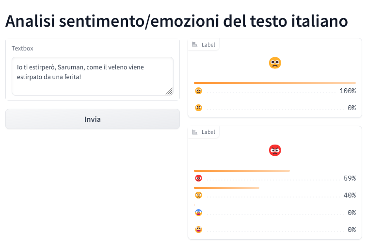
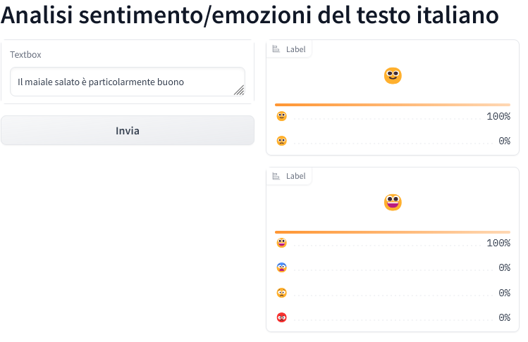
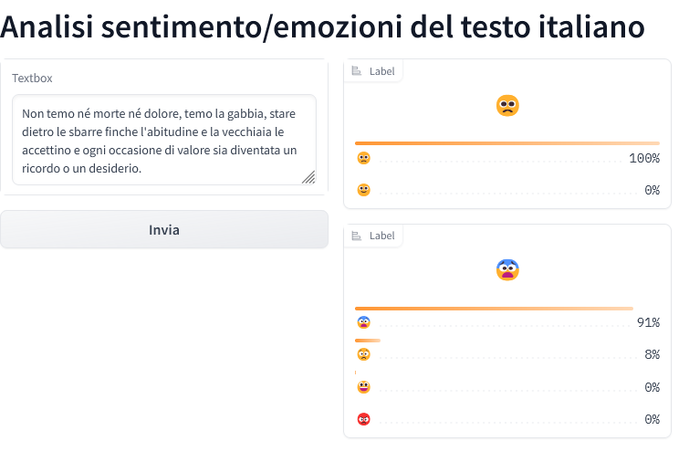
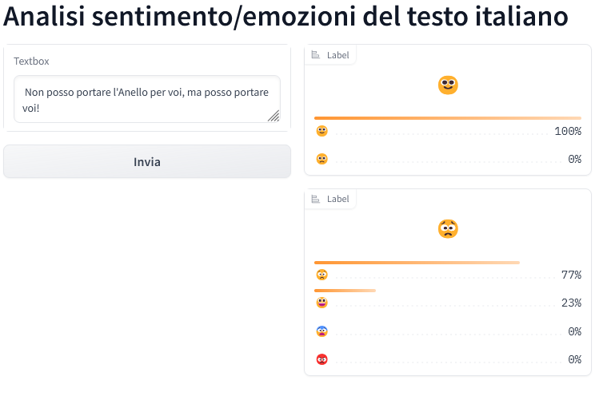

# testing NLP ITA!
A repo in italian for a NLP model testing. Mainly I'm focusing on serving as easily as possible a model using python/js without much back-end.
---

Lo scopo di questa repo è duplice: 
- Testing di framework  python e js per semplici dash di inference
- Testing di framework  python e js come back-end
---
Esempio dashboard con Gradio: 

>\
>*Gandalf è arrabbiato.*\

>\
>*Pipino è felice.*

>\
>*Eowin ha paura.*

>\
>*Sam è è triste, ma il messagio è positivo.*

---
Il modello di riferimento per NPL è  [feel-it](https://huggingface.co/MilaNLProc/feel-it-italian-emotion)

title = "FEEL-IT: Emotion and Sentiment Classification for the Italian Language"\
author = Bianchi, Federico and Nozza, Debora and Hovy, Dirk\
booktitle = "Proceedings of the 11th Workshop on Computational Approaches to Subjectivity, Sentiment and Social Media Analysis"\
year = 2021\
publisher = "Association for Computational Linguistics"
